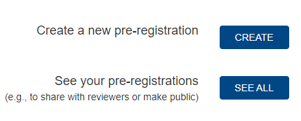
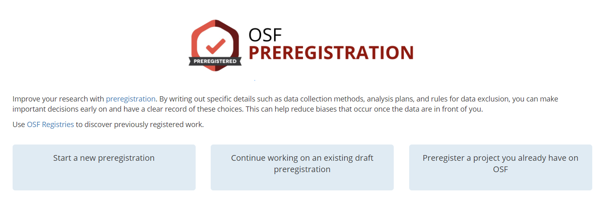
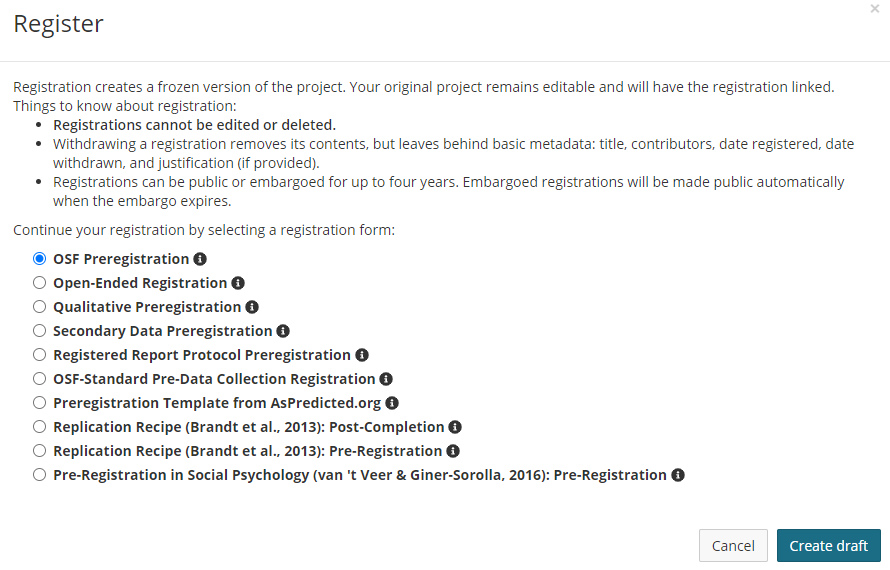
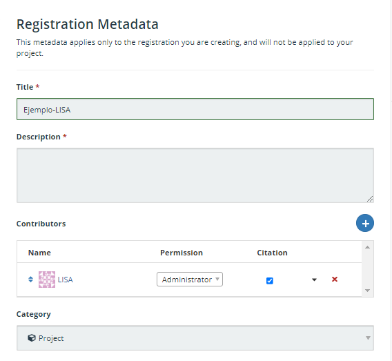
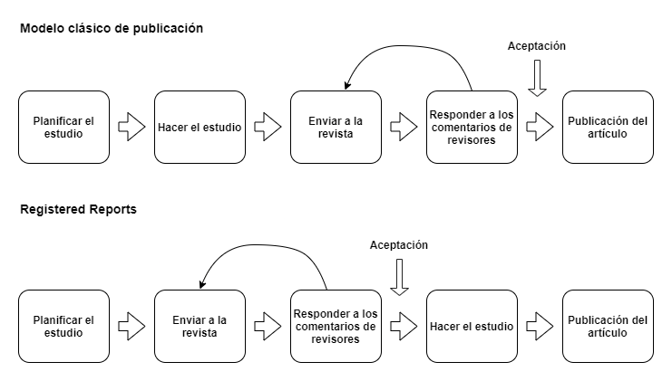

## Herramientas para los diseños transparentes

Nuestra principal apuesta para promover la transparencia en los diseños de investigación son los preregistros, por lo que es a lo que le dedicaremos más espacio de esta sección. De todos modos, también revisaremos un par de herramientas que pueden complementar el uso de preregistros. Esperamos que, posterior a esta sección, el lector pueda ser capaz de utilizar estas herramientas para sus investigaciones.

### Plantillas de preregistro

En la práctica, preregistrar un artículo es básicamente sintetizar la información importante sobre nuestra investigación en una plantilla estandarizada y alojar ese documento en un lugar público. Por lo que el primer paso para elaborar un preregistro es elegir la plantilla correcta. Existen plantillas estandarizadas que están estructuradas de tal forma que son útiles para preregistrar estudios de cualquier disciplina, así como también existen plantillas dedicadas a una disciplina o a situaciones particulares. En este apartado presentaremos plantillas bajo cuatro categorías: a) plantillas genéricas, b) plantillas para experimentos y previas a recolección de datos, c) plantillas para datos existentes/secundarios, c) plantillas para estudios de replicación y d) plantillas para _registered reports_. Además de proveer una descripción de cada una, orientaremos al lector para elegir una plantilla de acuerdo al tipo de investigación que está desarrollando.

El _Open Science Framework_ (OSF), que en español se traduce como un marco de referencia para la ciencia abierta, actúa cómo una herramienta y un repositorio que alberga las plantillas que trataremos en esta sección (y más). Para ver todas las plantillas disponibles en OSF hacer clic en el siguiente enlace: [https://osf.io/zab38/wiki/home/](https://osf.io/zab38/wiki/home/){target="_blank"}.

#### Plantillas Genéricas

Las plantillas genéricas son aquellas que pueden ser utilizadas independientemente de las características del estudio, ya que suelen incluir campos que abordan distintos tipos de situaciones (e.g. si un estudio es experimental o observacional). Acá revisaremos dos plantillas genéricas, la plantilla estándar de _AsPredicted_, y la plantilla estándar de OSF.

**AsPredicted**

La plantilla de AsPredicted es quizás una de las más conocidas para hacer preregistros, dado que está estandarizada y puede ser utilizada en cualquier disciplina. Recomendamos utilizarla cuando lo que se busque es optimizar tiempo y energías. La plantilla cuenta solamente con nueve preguntas clave que aplican a cualquier tipo de artículo. Esta plantilla la podemos encontrar tanto en OSF, como en la página de AsPredicted, en este caso, mostraremos cómo es el proceso en la página original.

Partimos por entrar a la página de AsPredicted, donde veremos algo similar a la Figura N° \@ref(fig:asp). Acá se nos da la opción de crear un preregistro, de ver los que ya hemos hecho (si es que ese es el caso) y también una breve descripción de AsPredicted. A grandes rasgos, la página nos dice que AsPredicted es una plataforma que busca facilitar el preregistro de estudios por parte de los investigadores a través de nueve simples preguntas. La página genera un documento .pdf y una URL asociada. También, cuenta cómo funciona el preregistro. Básicamente, un autor elabora un preregistro de un estudio y los coautores reciben un mail para aprobar ese preregistro. Una vez aprobado por todos los autores, el preregistro queda alojado en la plataforma de manera privada, y no cambia hasta que un autor decida hacerlo público. Además, en caso de que el estudio entre en revisión por pares, se puede enviar una versión anónima del preregistro. Por último, nos entrega una recomendación sobre qué hacer en el caso de que el proceso de investigación no haya podido apegarse totalmente a lo predicho.

(\#fig:asp)Botón para comenzar un preregistro

Para elaborar un preregistro debemos hacer click en el rectángulo azul que dice _Create_. Una vez hecho eso, nos pedirá una dirección de email para continuar. Cuando ingresemos un email, nos enviará un enlace al email que hayamos ingresado, con ese enlace podremos comenzar el preregistro. Una vez hayamos entrado en el enlace, veremos la plantilla de preregistro. Lo primero que aparece es una sección donde debemos escribir los emails de los autores colaboradores del estudio. También, nos da la opción de añadir otros emails además del que hemos introducido. Una vez pasada esta parte, ya nos encontramos con las preguntas del preregistro, que son las siguientes:

1) Recogida de datos. ¿Se han recogido ya datos para este estudio?
2) Hipótesis. ¿Cuál es la pregunta principal que se plantea o la hipótesis que se pone a prueba en este estudio?
3) Variable dependiente. Describa la(s) variable(s) dependiente(s) clave especificando cómo se medirán.
4) Condiciones. ¿Cuántos y qué condiciones se asignarán a los participantes?
5) Análisis. Especifique exactamente qué análisis realizará para examinar la pregunta/hipótesis principal.
6) Valores atípicos y exclusiones. Describa exactamente cómo se definirán y tratarán los valores atípicos, así como su(s) regla(s) precisa(s) para excluir las observaciones.
7) Tamaño de la muestra. ¿Cuántas observaciones se recogerán o qué determinará el tamaño de la muestra?
8) Otros. ¿Hay algo más que quiera preinscribir?
9) Nombre. Poner un título a este preregistro de AsPredicted
Finalmente. A efectos de registro, indíquenos el tipo de estudio que está preinscribiendo.

Las preguntas son bastante autoexplicativas, pero no está de más entregar algunos detalles adicionales. En la pregunta de recolección de datos, las opciones son tres: "Sí, se han recolectado datos", "No, no se han recolectado datos" y "Es complicado". Es importante mencionar que, en esta plantilla, la respuesta de que se han recolectado datos no es válida, por lo que si se está llevando a cabo un estudio con datos secundarios hay que responder "Es complicado" y en la pregunta 8 de la plantilla especificar por qué este preregistro sigue siendo válido pese a que los datos son preexistentes. Otro detalle importante es que cada pregunta está pensada para ser respuesta en aproximadamente una oración. Esta plantilla tiene el objetivo de ser lo más eficiente posible, por lo que, en general, se recomienda que todo el documento no pase de los 3200 caracteres. Otro detalle que especificar es que la pregunta acerca del tipo de estudio que se está preregistrando también es semicerrada, tenemos las opciones de: "Proyecto de clase", "Experimento", "Encuesta", "Estudio observacional" y "Otro". Es responsabilidad de quien hace el preregistro el seleccionar la opción que más se asemeje a su situación. Por último, es importante señalar que el preregistro, al menos en la página de AsPredicted, solo puede ser rellenado en inglés, por lo que en caso de utilizar otro idioma solicitará traducirlo.

**OSF Estándar**

La plantilla estándar de OSF también es de carácter general y busca abarcar distintas situaciones y tipos de estudios. La diferencia que tiene con la plantilla de AsPredicted es que contiene más preguntas y más detalladas. Por ejemplo, contiene preguntas relativas a en qué momento específico se está efectuando el preregistro (i.e antes de recopilar los datos, antes de cualquier observación humana a los datos, antes de acceder a los datos, entre otros) o si se harán transformaciones de las variables y su nivel de medición. La plantilla puede verse en este enlace: [https://osf.io/preprints/metaarxiv/epgjd/](https://osf.io/preprints/metaarxiv/epgjd/){target="_blank"}. A continuación, veremos el inicio del proceso para registrar en OSF, el cual sirve tanto para la plantilla estándar como para otras que veremos más adelante.

El primer paso es acceder a la sección específica de preregistros de la página de OSF, la cual se encuentra en el siguiente enlace: [https://osf.io/prereg/](https://osf.io/prereg/){target="_blank"} (para usar este servicio es necesario tener una cuenta). Si entramos al enlace, la apariencia de la página será algo similar a la Figura N° \@ref(fig:osfprereg1). Seleccionemos _Start a new preregistration_, le damos un nombre al proyecto y hacemos click en _Continue_. En la página siguiente, podemos ver que hemos creado un proyecto nuevo en OSF, el cual nos da la opción de preregistrarlo haciendo click en el botón _New registration_.

(\#fig:osfprereg1)Opciones para comenzar un preregistro en OSF

En la Figura N° \@ref(fig:osfprereg2) podemos ver dos cosas. Primero, la descripción de lo que está haciendo OSF al comenzar un nuevo preregistro, lo que en pocas palabras es una versión no modificable del proyecto al momento que hacemos el preregistro. En otras palabras, es una versión "congelada" del proyecto en OSF. Segundo, también se aprecia una serie de opciones para preregistrar, estas son las plantillas que mencionamos anteriormente. OSF nos ofrece distintas plantillas de acuerdo con el carácter que tiene nuestro estudio.

(\#fig:osfprereg2)Opciones de plantilla de pre-reistro

El primer paso es escoger la plantilla de acuerdo a la situación en la que nos encontremos. En este caso, seleccionamos la plantilla estándar de OSF. Una vez hayamos hecho eso, será necesario llenar los metadatos del estudio (e.g. Figura N°  \@ref(fig:osfprereg3)). Esta sección es transversal a todas las plantillas y consiste en registrar el título, descripción, contribuyentes, entre otras cosas que ayudan a identificar el proyecto.

(\#fig:osfprereg3)Ejemplo de campos de metadatos para rellenar

Una vez hayamos rellenado los campos correspondientes a los metadatos, podemos rellenar la plantilla de preregistro. Con los campos rellenados podremos proceder a preregistrar nuestro proyecto.

#### Plantillas para diseños experimentales y previas a recolección de datos

Considerando que el sentido original de un preregistro es que sea elaborado previo a la recolección y análisis de los datos, en principio cualquier plantilla genérica podría servir. Por ejemplo, la plantilla estándar de OSF ofrece preguntas detalladas que refieren al uso de diseños experimentales (i.e. cuáles son las condiciones de tratamiento o quiénes están al tanto de las manipulaciones experimentales del estudio). Sin embargo, OSF ofrece una vía alternativa para preregistrar estudios previo a la recolección de datos a través de la plantilla “OSF-Standard Pre-Data Collection pre-registration”. Esta plantilla es un complemento de la plantilla estándar y se utiliza solamente si es que el preregistro original está archivado en un documento. Esto quiere decir que, en el caso de que el equipo de investigación no haya usado el flujo de preregistro de OSF, sino que ya cuenta con un archivo que alberga el preregistro del estudio, entonces puede escoger esta plantilla de complemento  para no efectuar todo el proceso de nuevo.

Esta plantilla agrega algunas preguntas cruciales sobre la recopilación de datos, siendo las siguientes:

1. ¿Ha comenzado la recogida de datos para este proyecto? 

- No, la recopilación de datos no ha comenzado
- Sí, la recopilación de datos está en curso o se ha completado

2. ¿Ha mirado los datos?

- Sí
- No

3. Otros comentarios 

#### Plantillas para datos secundarios

En el último tiempo se ha comenzado a considerar cómo es que investigadores de las ciencias sociales empíricas que trabajan con datos preexistentes pueden, de todas maneras, preregistrar sus estudios para asegurar la credibilidad de sus hallazgos. Si bien OSF cuenta con una plantilla tipo para este tipo de situaciones (ver en [https://osf.io/x4gzt/](https://osf.io/x4gzt/){target="_blank"}), nosotros recomendamos la plantilla de @mertens_Preregistration_2019 dada la simpleza y exhaustividad de sus preguntas. La plantilla de @mertens_Preregistration_2019 se puede ver en el siguiente enlace: [ttps://osf.io/p26rq/](https://osf.io/p26rq/){target="_blank"}.

Esta plantilla está dirigida a investigadores que usen datos secundarios. Hace más simple el proceso de preregistro al enfocarse en las preguntas que se asemejan realmente a la situación del investigador que trabaja con grandes encuestas o datos administrativos, lo cual es muchas veces el caso en disciplinas como sociología, ciencias políticas o economía.

Esta plantilla cuenta con las siguientes diez preguntas:

1. ¿Cuál es la hipótesis que se investigará? 

2. ¿Cómo se operacionalizarán las variables cruciales?

3. ¿Cuál es la fuente de los datos incluidos en los análisis?

4. ¿Cómo se obtendrán estos datos? 

5. ¿Hay algún criterio de exclusión de los datos? 

6. ¿Cuáles son los análisis estadísticos previstos? 

7. ¿Cuáles son los criterios para confirmar y desconfirmar las hipótesis? 

8. ¿Se han validado los análisis con un subconjunto de datos? En caso afirmativo, facilite los archivos de datos y la sintaxis de los mismos.

9. ¿Qué se sabe sobre los datos que podría ser relevante para las hipótesis probadas? 

10. Facilite un breve calendario para los diferentes pasos del prerregistro.

Como podemos ver, además de los campos que se pueden encontrar en cualquier plantilla como la especificación de las hipótesis del estudio o los criterios de exclusión de datos, esta plantilla hace preguntas relativas al nivel de conocimiento previo de los datos. Por ejemplo, en la pregunta 4 solicita especificar la fuente de los datos. Como son datos secundarios, esto implica detallar cómo se accederá o serán solicitados los datos: si es que es necesario rellenar algún formulario o contactar a alguien en específico para obtener acceso. También, en la pregunta 9 se solicita describir cualquier conocimiento de algún patrón en los datos que sea relevante para la pregunta de investigación (e.g. la media o la mediana de una variable). Estos son ejemplos de preguntas que hacen esta plantilla útil para los investigadores que trabajen con datos preexistentes y que quieran preregistrar sus estudios.

#### Plantillas para estudios de replicación

Tratar en extenso qué es y cómo se hace un estudio de replicación escapa de los objetivos de este capítulo, sin embargo, es una práctica de la ciencia abierta que no podemos dejar fuera ya que también cuenta con una plantilla para prerregistro. Replicar un estudio significa regenerar los hallazgos de un estudio, siguiendo sus hipótesis y plan de análisis, pero con datos distintos. 

OSF ofrece dos plantillas para investigadores que tienen el objetivo de replicar un estudio. La primera es una plantilla para estudios de replicación previo a su ejecución, la cual incluye una serie de preguntas relativas al estudio original, por ejemplo, qué efecto se está buscando replicar, por qué es importante replicarlo o en qué área geográfica fue conducido el estudio original. Esta plantilla se puede ver en el siguiente enlace: [https://osf.io/4jd46/](https://osf.io/4jd46/){target="_blank"}. La segunda plantilla es para estudios de replicación que ya han sido completados. En este caso, las pvreguntas están relacionadas a los hallazgos del estudio de replicación, por ejemplo, cuál fue el efecto obtenido en la replicación y si se considera que este efecto logra replicar los resultados originales o no. El enlace para esta plantilla se puede encontrar en este enlace: [https://osf.io/9rp6j/](https://osf.io/9rp6j/){target="_blank"}.

#### Plantillas para _registered reports_

Cómo veremos en la siguiente sección, los _registered reports_ son un modelo alternativo de publicación donde el diseño del estudio pasa por un proceso de revisión por pares, a diferencia del modelo tradicional donde el documento que pasa por revisión por pares es el artículo finalizado. La plantilla que ofrece OSF es para estudios que han sido aceptados en la revisión por pares en una revista académica que cuenta con el modelo de _registered reports_. El objetivo de esta plantilla es poder dejar un registro público sobre el artículo en proceso, por lo que la plantilla de preregistro consta de, básicamente, una sección para el título del artículo, la fecha de aceptación, el manuscrito y archivos complementarios. Esta plantilla se puede ver en este enlace: [https://osf.io/gm36s/](https://osf.io/gm36s/){target="_blank"}.

## Otras herramientas

Sí bien los preregistros son una de las herramientas que más ha ido tomando protagonismo para promover la transparencia, existen otras. Específicamente, queremos mencionar dos de ellas: el modelo de _registered reports_ (en español, informes registrados) y la _transparency checklist_ (en español, lista de transparencia).

### Registered Reports

El modelo de _registered reports_ es una alternativa al modelo tradicional de publicación. Consiste en que el artículo atraviesa una revisión por pares en etapas tempranas de la investigación, específicamente **previo a la recolección de datos**. Esta práctica tiene por objetivo que el estudio sea evaluado por su innovación y calidad del diseño de investigación, más que por resultados impactantes [@chambers_Registered_2015]. Además, busca dejar sin efecto prácticas como el sesgo de publicación, p-hacking y HARKing, ya que no solamente existe una marca temporal que avala el diseño de investigación del estudio (como es el caso de un preregistro), sino que también existe un grupo de científicos anónimos que están de acuerdo con que el artículo es un aporte al conocimiento [@chambers_Registered_2013; @nosek_Registered_2014; @marsden_Introducing_2018].

Los _registered reports_ tienen dos características principales [@marsden_Introducing_2018]. Primero, un manuscrito con la justificación del estudio, lo que incluye una introducción, revisión de antecedentes y una pregunta de investigación, dando la posibilidad de una **aceptación preliminar** (IPA, por sus siglas en inglés _In principle acceptance_). La segunda característica es que el IPA no puede revocarse en base a los resultados del estudio, esto evita que trabajos con resultados no significativos no sean publicados y así combatir el sesgo de publicación. Relacionado a ambas características, los informes registrados pasan por dos etapas de revisión, la primera es la del manuscrito, siendo este el determinante de se el estudio se acepta o no, y la segunda revisión que se da posterior a terminar la recolección y análisis de datos. El modelo, en comparación al sistema tradicional de publicaciones, se puede ver en la Figura N° \@ref(fig:rr). 

(\#fig:rr)Método convencional y de registered reports para publicación cientifica

Para enviar un artículo bajo el modelo de _registered reports_, primero se debe tener en conocimiento cuáles son las revistas que cuentan con este tipo de revisión. El Centro para la Ciencia Abierta cuenta con una lista actualizada de revistas [aquí](https://www.cos.io/initiatives/registered-reports){target="_blank"}. Una vez escogida una revista, el proceso no es tan distinto al método convencional, en el sentido de que los investigadores envían su manuscrito con la justificación del estudio y este puede ser aceptado o rechazado por el editor, ya sea directamente o después de la corrección de algunos comentarios. Una vez se cuenta con el IPA y se efectúa la revisión en la segunda etapa, los revisores se aseguran de que el estudio ha seguido el plan de análisis inicialmente planteado y si sus conclusiones tienen sentido de acuerdo a los datos y resultados obtenidos, así como también que toda desviación del plan original sea debidamente justificada [@stewart_Preregistration_2020]. Desviaciones muy sustanciales y/o que no sean debidamente justificadas pueden conllevar el rechazo del artículo, aunque puede seguir el proceso en el método convencional de publicación [@stewart_Preregistration_2020].

### Transparency Checklist

La _transparency checklist_ es una herramienta complementaria elaborada por @aczel_consensusbased_2020 que busca acompañar el proceso de reportar un estudio, contribuyendo a que estos sean más transparentes. Esta lista ha sido elaborada específicamente para investigadores de las ciencias sociales y del comportamiento que trabajan con datos primarios, aunque puede ser útil para otros enfoques y disciplinas. La lista consta de 36 items divididos en cuatro categorías: preregistro, método, resultados y discusiones y accesibilidad de datos, donde cada ítem refiere a alguna característica de un reporte transparente, preguntando si ha sido efectuada o no, es decir, las respuestas posibles de cada ítem son "Sí", "No" y "N/A". Existe una versión más corta de 12 items, los cuales son los siguientes:

**_Sección de preregistro:_**

(1) Antes de analizar el conjunto completo de datos, se publicó un prerregistro con sello de tiempo en un registro independiente de terceros para el plan de análisis de datos.

(2) El estudio fue registrado…
- antes de que cualquier dato fuera recolectado
- después de que algunos datos fueron recolectados, pero antes de explorarlos
- después de que todos los datos fueron recolectados, pero antes de explorarlos
- después de explorar los datos, pero antes de que cualquier análisis estadístico fuera efectuado
- después de efectuar algunos análisis estadísticos, pero no todos
- en otro momento, explicar:

(3) El análisis estadístico previsto para cada pregunta de investigación (esto puede requerir, por ejemplo, información sobre la unilateralidad de las pruebas, los criterios de inferencia, las correcciones para pruebas múltiples, los criterios de selección de modelos, las distribuciones previas, etc.).

**_Sección de método_**

El manuscrito describe completamente...

(4) la justificación del tamaño de la muestra utilizado (por ejemplo, un análisis de potencia a priori).

(5) el diseño, los procedimientos y los materiales del estudio para permitir una réplica independiente.

(6) las medidas de interés (por ejemplo, la amabilidad) y sus operacionalizaciones (por ejemplo, un cuestionario que mide la amabilidad).

(7) ¿algún cambio en el prerregistro (como cambios en los criterios de elegibilidad, en los límites de pertenencia al grupo o en los procedimientos experimentales)?

**_Sección de resultados y discusión_**

El manuscrito…

(8) distingue explícitamente entre la "confirmación" (es decir, preestablecido) y "exploratorio" (es decir, no preestablecidos).

**_Sección de disponibilidad de datos, código y materiales_**

Se han hecho públicas las siguientes…

(9) los datos (procesados) en los que se han basado los análisis del manuscrito.

(10) todo el código y el software (que no esté protegido por derechos de autor).

(11) todas las instrucciones, los estímulos y los materiales de las pruebas (que no estén protegidos por derechos de autor).

(12) El manuscrito incluye una declaración sobre la disponibilidad y localización de todos los elementos de la investigación, incluidos los datos, materiales y códigos pertinentes para su estudio.

Tanto la versión completa de 36 items, como la recortada de 12 están disponibles para rellenar en línea. [Aquí](http://www.shinyapps.org/apps/TransparencyChecklist/){target="_blank"} se puede encontrar la lista online, es una aplicación de uso simple, además que permite generar el reporte final de manera automática.
