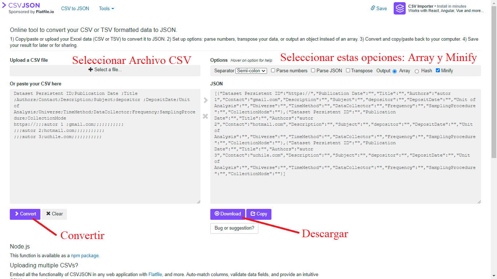

## Consejos para la Apertura de Datos de Investigación Social

A continuación, se presenta una sencilla pauta sobre cómo y dónde publicar abiertamente información cualitativa o cuantitativa producida por investigaciones sociales, cumpliendo con estándares internacionales de almacenamiento. Esta pauta ayuda a cumplir con objetivos señalados por el Consejo Internacional para la Ciencia [@icsu_open_2014], los cuales promueven el acceso oportuno a los registros científicos sin barreras, mejorando su calidad y de modo que sea perdurable en el tiempo. Igualmente, proponemos una guía de almacenamiento que permite cumplir con los principios FAIR (Findable, Accessible, Interoperable, Reusable) promovidos por organizaciones científicas del Estado Chileno, americanas y europeas [@anid_con_2020; @ramirez_ciencia_2019; @ec_fair_2016]. Los estándares FAIR tienen el objetivo de hacer los datos fáciles de encontrar en la web y que estén en formatos que cualquier investigador pueda utilizar [@fair_fair_2020]. 

Esta pauta para la publicación de datos fue creada en base a otros materiales de apoyo con objetivos similares, como la guía de preparación de datos creada por el Consorcio interuniversitario para la investigación política y social (ICPSR), el manual de Autoevaluación para proveedores de repositorios abiertos (RISE) del Digital Curation Center (DDC) [@ddc_using_2017], los planes europeos de manejo de datos (DMP) y los consejos de distintos investigadores tanto para datos cuantitativos como cualitativos [@ccsds_recommendation_2012; @kapiszewski_transparency_2019].

Para publicar los datos de investigación proponemos los siguientes tres momentos:

### __Preparar__ 

#### Datos cualitativos: 

Considerando que al estar presente en la entrevista se cuenta con una mayor información que solo leyendo su transcripción, cualquier anotación que dé cuenta del ambiente anímico de la entrevista o del gesto que acompaña alguna frase es bienvenida. También es importante subir la pauta de la entrevista si es que existe. Asimismo, aquellos investigadores que hacen un análisis mediante codificación tienen registro del proceso por el cual llegaron a los códigos utilizados para la categorización de la información. Además, esto puede ser complementado con la descripción de las discusiones que surgieron entre el equipo de investigación para establecer tales códigos y el esquema de análisis [@kapiszewski_transparency_2019].

Igualmente necesario es cambiar en el texto y/o audio lo que sea necesario para que los sujetos de investigación no puedan ser identificados. También es conveniente compartir el cuaderno de campo de la investigación.

Esta información bien almacenada no solo ayudará a las ciencias sociales por su apoyo con información a otros investigadores, sino que conjuntamente es un gran aporte a la formación de los estudiantes sobre cómo investigar cualitativamente, pues estos materiales permiten una aproximación más concreta al proceso de investigación cualitativo [@bishop_revisiting_2017].

**Confidencialidad en datos cualitativos**

Respecto a la confidencialidad de los datos, ICPSR recomienda que: antes de enviar datos cualitativos a un archivo, los depositantes de datos deben tener cuidado de eliminar la información que permita identificar a cualquiera de sus sujetos de investigación. Este proceso se puede hacer menos arduo creando un esquema para anonimizar antes de la recopilación de datos y anonimizando los datos a medida que se crean los archivos cualitativos para el análisis.

Algunas de las modificaciones que se pueden hacer a los datos cualitativos para asegurar confidencialidad del entrevistado, según Marz y Dunn (2000), son: (1) Reemplazar nombres reales con texto generalizado; (2) Reempalzar fechas; (3) Eliminar elementos únicos y/o publicitados.

Dado que los investigadores están más familiarizados con sus datos, se les pide que utilicen su juicio sobre si cierta información cualitativa en combinación con el resto del texto o información cuantitativa relacionada podría permitir la identificación de un individuo.

Los depositantes de datos deben documentar cualquier modificación para enmascarar información confidencial en los datos cualitativos. Esto garantizará que el personal del archivo no realice cambios innecesarios en las modificaciones del investigador cuando realice su revisión de confidencialidad. Por tanto, la información también se pondrá a disposición de los usuarios secundarios de los datos para ayudarles a utilizarlos.

#### Datos cuantitativos:

**Bases de datos**

Para resguardar la calidad de nuestros datos debemos asegurar una correcta **codificación de las respuestas y nombramiento de las variables**, ambas bases fundamentales de los datos (filas y columnas). Para esto, ICPSR propone, entre otros, los siguientes puntos: 

**Errores de codificación**

Verifique cuidadosamente la coherencia entre las respuestas del cuestionario y los valores en la base de datos para el primer 5 a 10 por ciento de los registros de datos creados y luego elija registros aleatorios para controles de calidad. Posteriormente, puede realizar análisis descriptivos de distribución para evaluar si existen valores atípicos atribuibles a errores de codificación (por ejemplo 66 en la variable hijos en vez de 6). El uso de computadores y programas de encuesta y codificación puede ayudar a disminuir estos errores. Algunos de los serivicios recomendados son Qualtrics o SurveyMonkey, entre otros.

**Recodificación automática**

Al recodificar la fuente original de datos (sin procesar), es recomendable dejar que la computadora realice codificaciones y rectificaciones complejas. Por ejemplo, para crear una serie de variables que describen la estructura familiar, escriba un código de computadora para realizar la tarea.

Los códigos de computadora no solo son precisos si las instrucciones son precisas, sino que también se puede cambiar fácilmente para corregir un error lógico o de programación. Incluya en la documentación los códigos utilizados para la recodificación. 

**Consistencia**

Evalúe la coherencia entre las variables, identificando a quienes poseen combinaciones incoherentes. Por ejemplo, si alguien señala que su hijo no asiste a la escuela y luego responde preguntas sobre la escuela. Esto también es posible de realizar a través de filtros en un cuestionario bien diseñado.

**Identificadores individuales y grupales**

Proporcione variables identificadoras suficientes. Es fundamental que cada sujeto posea un identificador único. Además, si la encuesta es longitudinal, se puede proporcionar junto al identificador de encuestado, un identificador por cada ocasión que contesta la encuesta. Otros identificadores dependen del tema del estudio, por ejemplo, si se trabaja con escuelas, verifique que cada escuela tiene un identificador id-escuela. Si trabaja con encuestados de modo tal que dos o más son de la misma familia y cada encuestado corresponde a un núcleo familiar, indique un único identificador para cada familia. 

**Nombres de Variables**

El nombre de la variable será con lo que más se trabajará con los datos, por ende, deben ser claros y utilizables por distintitos softwares. 

Existen distintos estándares para elegir los nombres de las variables. 

1. El primero consiste en asignar un numero único anteponiendo una V de modo tal que, siendo n el número de variables, las variables se nombran como *Vn* según su posición (p ej. V0001, v0002,...Vn). Se antepone la V por que los softwares en general no permiten nombres de variables con solo caracteres numéricos. 

2. El segundo modo utiliza letras y números para agrupar las variables según escalas o temas (por ejemplo Q1,Q2a,Q2b), si bien es un sistema que entrega más información, no informa sobre el contenido. 

3. El tercero consiste en utilizar abreviaturas mnemotécnicas, es decir, nombres cortos de variables que representan el significado sustantivo de las variables facilitando su memorización y comprensión. Por ejemplo _educpadr_ como "Educación del Padre". Este tipo de nombres podrían ayudar a disminuir los errores en los análisis producidos por agregar una variable incorrecta en el código. El problema es que con la limitación de caracteres de los softwares es difícil generar abreviaturas arbitrarias que sean ampliamente reconocibles por un público diverso. 

4. El cuarto consiste en abreviaciones compartidas y registradas. Un sistema de raíces y sufijos. Por ejemplo, todas las variables que tienen que ver con la educación pueden tener la raíz ED, y podría expresarse "Educación del Padre" como FAED, siendo esta nomenclatura previamente documentada. Esto implica una planificación previa y capacidad de organización para compartir las abreviaturas, así como herramientas para facilitar el encontrar las abreviaturas correctas en la biblioteca o documento de sufijos y prefijos. 

En consideración de estas opciones expuestas por ICPSR, se recomienda utilizar la tercera, puesto que cumple con la cualidad de la primera y la segunda de identificar las variables de modo único, a la vez que cumple con el criterio de hacer más comprensible y fácil de recordar. 

Junto a lo señalado por ICPSR, consideramos que al crear un nombre de la variable este debe ser utilizable por los distintos softwares comúnmente utilizados como SPSS, STATA y R. En vista de lo anterior sugerimos: 

+ Dos variables no pueden tener el mismo nombre
        
+ No utilizar más de 12 caracteres en el nombre 

+ Empezar con una letra

+ Deben ser solo alfanuméricos (Números y letras, sin símbolos . ; , : “ $ @)

+ En minúscula 

+ No utilizar la letra ñ, remplazarlo por gn (agnos, en vez de años)

+ No utilizar palabras con tildes (tipo á; ü)

+ Remplazando espacios por guion bajo. (edad_rec)
        
        
        
**Etiquetas de variables**

Las variables deben ser correctamente etiquetadas. Las etiquetas deben partir con el número del ítem en el cuestionario para poder asociarlo. Luego debe darse información sobre el contenido de la variable o ingresar directamente la pregunta realizada al encuestado. 

Considerando las limitaciones de caracteres de los softwares, en base a manuales universitarios de SPSS y STATA, se sugiere que las etiquetas de las variables no superen los 120 caracteres. 
        
        
**Codificación**

+ **Variables de identificación**. Proporcione campos al comienzo de cada registro para acomodar todas las variables de identificación. Las variables de identificación a menudo incluyen un número de estudio único y un número de encuestado para representar cada caso.

+ **Categorías de código**. Las categorías de códigos deben ser mutuamente excluyentes, exhaustivas y estar definidas con precisión. Cada respuesta de la entrevista debe encajar en una y solo una categoría. La ambigüedad provocará dificultades de codificación y problemas con la interpretación de los datos.
 
+ **Conservación de la información original**. Codifique tantos detalles como sea posible. Registrar datos originales, como edad e ingresos, es más útil que colapsar o poner entre corchetes la información. Con datos originales o detallados, los analistas secundarios pueden determinar otros paréntesis significativos por sí mismos en lugar de limitarse a los elegidos por otros.
  
+ **Preguntas cerradas**. Las respuestas a las preguntas de la encuesta que están precodificadas en el cuestionario deben conservar este esquema de codificación en los datos legibles por máquina para evitar errores y confusiones.

+ **Preguntas de final abierto**. Para los ítems abiertos, los investigadores pueden usar un esquema de codificación predeterminado o revisar las respuestas iniciales de la encuesta para construir un esquema de codificación basado en las categorías principales que surgen. Cualquier esquema de codificación y su derivación deben informarse en la documentación del estudio.

+ **Respuestas codificadas por el usuario**. Cada vez más, los investigadores envían el texto completo de las respuestas a las preguntas abiertas a los archivos para que los usuarios puedan codificar estas respuestas ellos mismos. Debido a que dichas respuestas pueden contener información confidencial, deben ser revisadas por riesgo de divulgación y, si es necesario, tratadas por archivos antes de su publicación. 

+ **Comprobar codificación**. Es una buena idea verificar el código de algunos casos durante el proceso de codificación, es decir, repetir el proceso con un codificador independiente. Por ejemplo, si se asigna más de un código a la respuesta de una entrevista, esto resalta problemas o ambigüedades en el esquema de codificación. Esta codificación de verificación proporciona un medio importante de control de calidad en el proceso de codificación.

+ **Serie de respuestas**. Si una serie de respuestas requiere más de un campo, organizar las respuestas en clasificaciones importantes significativas es útil. Respuestas dentro de cada especialidad o categoría se les asigna el mismo primer dígito. Los dígitos secundarios pueden distinguir respuestas específicas dentro de las categorías principales. Tal esquema de codificación permite el análisis de los datos utilizando agrupaciones amplias o categorías más detalladas.

**Identificar Casos perdidos**

ICPSR no establece un modo determinado de identificar los casos perdidos, aunque señala las ventajas y desventajas de distintos tipos de codificación. Igualmente sugiere distintos tipos de casos perdidos que deben ser identificados. Cabe destacar que, como regla general para la preservación, los casos perdidos se deben codificar del modo más similar a las categorías de las variables, de modo tal que una variable numérica de un digito se indica con (8,9) y una variable categórica con alternativas de texto con ("No sabe", "No responde")

* Rechazo / Sin respuesta. El sujeto se negó explícitamente a responder una pregunta o no la respondió cuando debería haberlo hecho.

* No lo sé. El sujeto no pudo responder una pregunta, ya sea porque no tenía una opinión o porque la información requerida no estaba disponible (por ejemplo, un encuestado no pudo proporcionar los ingresos familiares en dólares del año anterior).

* Error de proceso. Por alguna razón, no hay respuesta a la pregunta, aunque el sujeto proporcionó una. Esto puede resultar de un error del entrevistador, codificación incorrecta, falla de la máquina u otros problemas.

* No aplica. Al sujeto nunca se le hizo una pregunta por alguna razón. A veces, esto se debe a patrones de omisión después de preguntas de filtro, por ejemplo, a los sujetos que no están trabajando no se les pregunta sobre las características del trabajo. Otros ejemplos de inaplicabilidad son los conjuntos de elementos solicitados solo de submuestras aleatorias y los solicitados a un miembro de un hogar, pero no a otro.

*  Sin coincidencia. Esta situación surge cuando los datos se obtienen de diferentes fuentes (por ejemplo, un cuestionario de encuesta y una base de datos administrativa) y no se puede localizar la información de una fuente.

* Datos no disponibles. La pregunta debería haberse formulado al encuestado, pero por otro motivo distinto de los enumerados anteriormente, no se dio ni registró ninguna respuesta.

Considerando las ventajas y desventajas de las distintas formas de codificación se sugiere utilizar valores perdidos con valores altos en negativo de modo tal que sean estándar para todas las variables y no sean confundible con los valores posibles de dichas variables. Se propone utilizar los siguientes valores perdidos, usando numéricos o caracteres según corresponda. 

| Código de texto   | Código numérico |
|-------------------|-----------------|
| No responde       | -999            |
| No sabe           | -998            |
| Error de Proceso  | -997            |
| No aplica         | -996            |
| Sin coincidencia  | -995            |
| No disponible     | -994            |

Para obtener información adicional sobre datos georreferenciados e imputaciones revise directamente la guía ofrecida por ICPSR disponible en este [enlace](https://www.icpsr.umich.edu/files/deposit/dataprep.pdf)

### **Documentar**

Existen distintos estándares sobre qué información incorporar junto con los datos, destacando la importancia de que estos materiales sean legibles por humanos y por inteligencia artificial [@fair_fair_2020]. A continuación, se propone un conjunto de documentos comunes que deben estar incluidos, junto con una guía de como escribirlos en formato abiertos para cumplir con las recomendaciones del libro *Managing and sharing research data: a guide to good practice* [@corti_managing_2019].

**Readme**

El readme es un documento que debe responder las siguientes preguntas sobre la producción de la información [@tierney_realistic_2020]. 

- Quién produjo la información

- Cuál es el contenido de los datos

- Cuándo fue producida la información

- Dónde fue recolectada

- Por qué se recopiló

- Cómo se recopiló 

Para crear este documento se suele utilizar el formato y lenguaje Markdown de extensión .md. Este formato posee la ventaja de no ser un formato propietario que permite incluir de modo sencillo distintos elementos útiles como enlaces, imágenes y tablas. Le recomendamos realizar la escritura en este formato. Para ello se puede escribir el documento en RStudio señalando como extensión .md o para quienes no manejen el software, pueden crear el documento en la página [Dillinger](https://dillinger.io/). 

**Licencia**

La licencia se puede crear fácilmente al publicar los datos en el Open Science Framework. En la siguiente sección se señala cómo hacerlo. 

**Metadatos**

La creación de los metadatos requiere previamente que se cree el identificador y la página web en OSF que almacenara los datos. Por ello la creación de los metadatos será posterior a la publicación. Cabe desacatar que el modo de crear metadatos difiere según si el tipo de material es una transcripción de entrevista en PDF o una base de datos en formato sav, stat o rda. 

**Documentos especiales según tipo de metodología**

Para publicar datos cuantitativos se recomienda recopilar y producir los siguientes materiales con el objetivo de que los usuarios de la base de datos cuenten con información suficiente para utilizarla correctamente. Los siguientes documentos deben ser subidos en PDF y Block de notas.txt con codificación utf8. 
    
  * Cuestionario
  * Consentimiento informado
  * Libro de códigos
  * Ficha técnica
  * Manual de usuario
  * Descriptivos (Optativo)
  * Publicaciones asociadas a los datos (Optativo)
  * Descripción e información detallada para metadatos. 
    

Para publicar datos cualitativos se sugiere documentar la siguiente información. 

* Transcripciones

* registros audiovisuales (de ser necesario)

* Investigar métodos y prácticas que estén completamente documentados

* Copia en blanco del formulario de consentimiento informado con el número de aprobación del IRB

* Detalles sobre el escenario de las entrevistas

* Detalles sobre la selección de los sujetos de la entrevista

* Instrucciones dadas a los entrevistadores

* Instrumentos de recopilación de datos como cuestionarios de entrevistas

* Medidas tomadas para eliminar identificadores directos en los datos (por ejemplo, nombre, dirección, etc.)

* Cualquier problema que surgió durante el proceso de selección y/o entrevista y cómo se manejaron

* Lista de entrevistas

### **Publicar**

**OSF y plataformas para publicar datos**

La plataforma web Open Science Framework (OSF) ofrece gratuitamente servicios de infraestructura digital que permite un espacio de registro para las distintas etapas de un proyecto de investigación. Actualmente existen otras plataformas con objetivos similares como Zenodo, Dataverse, GitHub, Mendeley, Figshare, Dryad o ICPSR, y si bien todas son buenas herramientas, se remienda utilizar OSF por diversos motivos señalados por @kryvokhyzha_best_2019 y un documento informativo de la Librería de Universidades de la Universidad de OKLAHOMA [-@universitarias_make_2020]. En primer lugar, a diferencia de Dryad, OSF es una plataforma gratuita, con mejor estructura de repositorios y con posibilidades de corregir errores. En segundo lugar, Figshare tiene la capacidad de estructurar los repositorios en distintos componentes, pero no está optimizado para descargar muchos archivos a la vez y, además es una empresa con fines de lucro. Por su parte OSF, permite estructurar de diversos modos los repositorios, esta optimizado para descargas y es una organización sin fines de lucro que es financiada por el Centro para la Ciencia Abierta [(cos)](https://www.cos.io/) con recursos para 50 años más. En tercer lugar, a diferencia de Zenodo y GitHub, OSF si cuenta con estadísticas de descarga que nos permiten evaluar la visibilidad de los datos. En último lugar, GitHub si bien es una alternativa que ha sido utilizada para este fin, en realidad más que una plataforma para subir datos es una plataforma para crear códigos de forma colaborativa, usualmente de aplicaciones, además no nos permite crear de modo automático un DOI, lo cual es fundamental para cumplir con los principios FAIR. 

No obstante, si el equipo investigador lo considera conveniente podría subir sus datos a múltiples plataformas. En esta línea, además de OSF, recomendamos almacenar los datos paralelamente en [OpenICPSR](https://www.openicpsr.org/openicpsr/workspace?path=openICPSR) puesto que esto permitirá conectar nuestros datos con el buscador de ICPSR, el cual tiene amplia visibilidad dentro del campo de las ciencias sociales a nivel internacional. 

En esta página, un usuario puede crear un repositorio denominado proyecto, que puede contener, al mismo tiempo, componentes que pueden ser investigaciones o datos específicos dentro del proyecto. Se pueden crear más componentes de estos tipos de los componentes del proyecto. Esta estructura permite almacenar conjuntamente algunos trabajos relacionados.

La plataforma promueve que se registren productos de la investigación de las distintas etapas del proceso. En primer lugar, posee un espacio para los "pre-registros" que son un documento en el cual se expone brevemente el diseño de la investigación, las hipótesis y la metodología, lo cual aumenta la rigurosidad de las investigaciones.

Ambas evaluaciones de OSF señalan que un problema es el límite de almacenamiento de solo 5gb por archivo. Este límite ha sido modificado el 5 de noviembre del 2020, agregando un límite de 5gb a los proyectos que estén privados y 50gb a los públicos. No obstante, el problema del espacio se puede resolver conectando OSF con otros servicios de almacenamiento con mayor capacidad.

**Crear Metadatos para datos cualitativos o cuantitativos.**

__Paso 1__ 

Para crear los metadatos de forma muy sencilla se puede utilizar un archivo csv, que se puede editar con el programa Excel o cualquier Hoja de cálculo. A continuación, entregamos un link para descargar un csv con los campos para rellenar los metadatos, cumpliendo con los campos utilizados por Dataverse Harvard y los "Social Science and Humanities Metadata" de ICPSR.

Para crear los metadatos usted solo debe escribir en las casillas de abajo de las categorías, la respuesta para cada uno de los campos, señalando el identificador, el Título de los datos, los autores, entre otros. Es necesario que rellene los campos en inglés. Con una traducción simple de [Google Traductor](https://translate.google.com/) o [DeepL](https://www.deepl.com/es/translator) es suficiente. 

Para descargar el archivo csv editable en Excel seleccione [Descargar Metadata.cvs](https://raw.githubusercontent.com/franciscomeneses/CADIS/master/metadata.csv). Si no le ofrece directamente abrirlo con Excel, puede apretar click derecho sobre el archivo, seleccionar "Abrir con", luego Excel, si no aparece seleccionamos "Elegir otra aplicación", "Más aplicaciones" y luego Excel. 

Cabe destacar que, para el primer campo correspondiente al Identificador, antes del código entregado por OSF debe estar escrito https://doi.org/ como se muestra en el documento descargado. Esto es para cumplir con los estándares FAIR. 

__Paso 2__

Después de haber creado el documento csv con nuestra información solo debemos seleccionar al siguiente link e ir al sitio web:  [csvjson.com](https://csvjson.com/csv2json). En este sitio tenemos que apretar Select a file... y buscar el documento csv creado. Posteriormente, se debe señalar output: "Array" y "Minify", como se señala en la imagen. Con estas opciones apretamos el botón morado >Convert bajo el cuadrado que posee nuestro documento CSV. Cuando esté listo apretamos el botón Download, como se señala en la Figura N° \@ref(fig:csvjson). El documento se descargará con el nombre csvjson, debe cambiarlo a metadata. 

(\#fig:csvjson)Creación de documento de metadatos

__Paso 3__

Finalmente debemos agregar los archivos csv y json al repositorio, recuerde cambiar el nombre del documento a metadata. 

