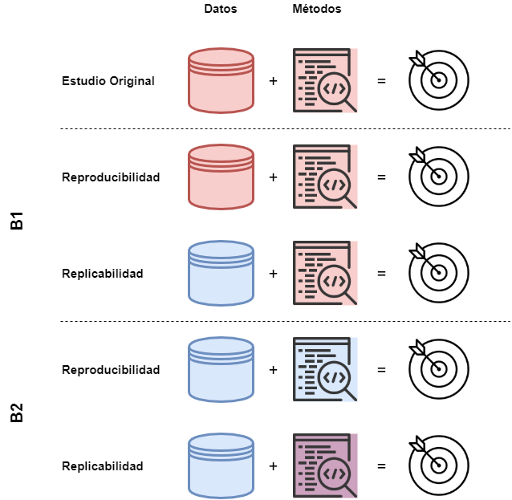
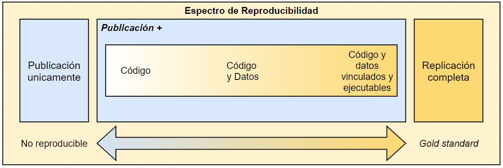
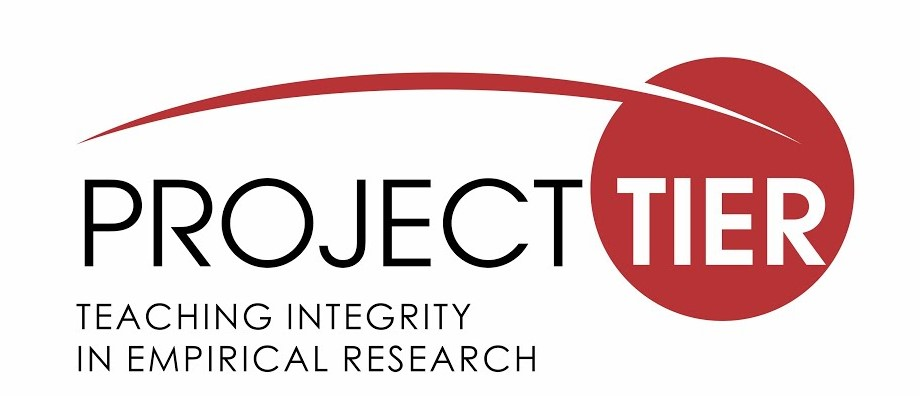
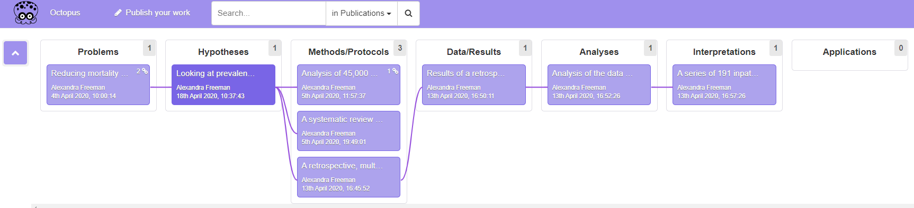

# Análisis reproducibles

En la discusión sobre los problemas de transparencia en torno a los procedimientos de investigación, se vuelve necesario precisar de qué manera es entendido el concepto de reproducibilidad en la ciencia. En esta línea, la laxitud con que se ha empleado el término ha llevado a definiciones poco claras, lo cual ha generado una tendencia a confundir lo que refiere a la transparencia de un proceso único que ya ha sido realizado, con un proceso nuevo y que puede realizarse de manera reiterativa, obteniendo los mismos resultados. Por este motivo, esta sección propone dar luces respecto a cómo entendemos el concepto de reproducibilidad, en contraste con el de replicabilidad en la ciencias sociales.

La discusión en torno a cómo se entiende la **reproducibilidad**, habitualmente lleva al contraste respecto al concepto de **replicabilidad**. Al respecto @earth_Reproducibility_2019 mencionan que, por un lado, con el incremento de las herramientas computacionales a principios de los años 90’, el término de "investigación reproducible" era concebido como las investigaciones que proveían un compendio detallado de la documentación, código y datos que permitieran obtener los mismos resultados publicados por los autores, enfatizando que los análisis fueran transparentes y claros con el objetivo de ser verificados por sus pares. Por otro lado, los autores sostienen que, en otras disciplinas, el concepto de reproducibilidad era asociado a investigaciones independientes entre sí en términos de los datos empleados, los materiales, métodos e implementación de un estudio, lo cual estaría orientado a robustecer o cuestionar la evidencia previa [@earth_Reproducibility_2019, pp 33-34]. Actualmente, a esta última práctica se la entiende como replicabilidad de una investigación y no debe ser confundida con el concepto de reproducibilidad [@barba_Terminologies_2018].

@barba_Terminologies_2018 sugiere que la confusión entre reproducibilidad y replicabilidad ha contribuido a obstaculizar las prácticas en ambas dimensiones. En una revisión reciente realizada por la autora se han identificado al menos tres escenarios o versiones de cómo se entienden ambos conceptos en una amplia gama de disciplinas que van desde las ciencias sociales hasta estudios clínicos en las ciencias médicas. El primer escenario (A), y a la vez el más común, es donde el uso de ambos conceptos es indistinto, contribuyendo a la ya mencionada confusión. El segundo escenario (B1) es cuando la reproducibilidad es entendida como la situación en que los datos originales y el código de análisis son empleados para **regenerar** los resultados originales, mientras que la replicabilidad es entendida cuando investigadores o equipos independientes utilizan datos nuevos para obtener los mismos resultados que la investigación previa. Finalmente, un tercer escenario (B2) es cuando la reproducibilidad es entendida cuando investigadores o equipos independientes obtienen los mismos resultados empleando sus propios datos y métodos, mientras que la replicabilidad es entendida cuando investigadores o equipos independientes llegan a los mismos resultados empleando los artefactos digitales [^1] originales del autor con menores o mayores modificaciones, los cuales han sido puestos previamente a disposición de sus pares. La Figura N° \@ref(fig:scenarios) ilustra cómo podemos entender los escenarios B1 y B2 en relación a la distinción entre reproducibilidad y replicabilidad. El color rojo, tanto en los datos como en los métodos, indica que los componentes empleados son idénticos a los del estudio original. Por otro lado, el color azul indica que tanto los datos como los métodos son distintos a los del estudio original. Finalmente, el color morado en los métodos se entiende como un punto intermedio y refiere a cuando se han empleado métodos que siguen las indicaciones del estudio original, pero que han incorporado modificaciones, nuevos métodos u otras innovaciones metodológicas (p. ej. métodos nuevos, pruebas de robustez u otros).

[^1]: @barba_Terminologies_2018 lo define como un compendio que detallar la estrategia de medición, diseño del estudio o código de análisis originales de un autor

(\#fig:scenarios)Escenarios B1 y B2 en reproducibilidad y replicabilidad.

En las ciencias sociales, el debate en torno a la investigación reproducible y la replicabilidad no ha estado ausente. Como fue reseñado en el capítulo de transparencia, existen casos icónicos en torno a prácticas cuestionables de investigación que han afectado la confianza en la investigación científica, lo cual ha contribuido a incrementar los esfuerzos por una ciencia social abierta y reproducible [@breznau_does_2021; @nosek_Promoting_2015]. En los tres escenarios descritos por @barba_Terminologies_2018, las ciencias sociales han experimentado de manera diversa el ajuste hacia una cultura de mayor apertura y precisión en torno a los problemas de la crisis de reproducibilidad, principalmente a través del estudio sistemático de dicha problemática, dentro de lo cual la psicología ha sido pionera en proveer evidencia para este debate [e.g. @opensciencecollaboration_Estimating_2015; @gilbert_Comment_2016]. Al respecto @bishop_Rein_2019 sostiene que una de las principales amenazas para el progreso de la ciencia en general ha sido la falta de reproducibilidad de los resultados (_irreproducibility_), lo cual ha afectado principalmente la robustez y credibilidad de la evidencia reportada por las investigaciones, problema que también ha sido identificado en las ciencias sociales, principalmente por la falta de precisión en los procedimientos y las barreras de acceso a materiales clave del proceso de análisis [@freese_Replication_2017].

Entonces, retomando la distinción clave entre lo que entendemos por **reproducibilidad** y **replicabilidad**, en su revisión, @barba_Terminologies_2018 sugiere que una manera de entender y distinguir ambos conceptos de manera minimalista puede descansar en el carácter de los _datos_ y los _métodos_.  Al respecto @nosek_Promoting_2015 sostiene que en lo que refiere a estas dos dimensiones, los niveles en que una publicación los incorpora es gradual y puede entenderse como un continuo o espectro [@peng_Reproducible_2011] y, por tanto, el nivel en que se cumplen bajo determinados criterios nos permite definir el carácter de una investigación en términos de su reproducibilidad. Por ejemplo, la Figura N° \@ref(fig:espectro) nos muestra cómo podemos caracterizar una investigación publicada en torno al acceso y vinculación entre código y datos. Por un lado, se observa que en el polo donde únicamente disponemos de la publicación, se entiende como la ausencia de reproducibilidad. Por otro lado, en la medida que incrementa el acceso a los materiales, y se explicita el enlace entre ellos, se puede caracterizar a una publicación como reproducible. [^2]

[^2]: En la figura original, @peng_Reproducible_2011 muestra el polo derecho como el mejor escenario y lo clasifica como *Full replication*, sugiriendo que el mejor estándar para poner a prueba los hallazgos de una investigación científica es la replicación, pero en la ausencia de dicha posibilidad la reproducibilidad de los resultados debiese ser un estándar mínimo

(\#fig:espectro)Espectro de Reproducibilidad. Traducción propia en base a @peng_Reproducible_2011 

Como sugieren @nosek_Promoting_2015, el problema de la ausencia o falta de reproducibilidad debe ser abordado a través de un cambio en las prácticas de investigación, para lo cual se requiere de una disposición por parte de la comunidad científica, es decir, que se le atribuya un _sentido_ positivo a estas prácticas. Sin embargo, @peng_Reproducible_2011 sostiene que una de las principales barreras para promover estas prácticas ha sido la falta de mecanismos que faciliten la distribución de la investigación reproducible, como también la poca claridad respecto de los estándares asociados a ello. Siguiendo esta autocrítica de algunos sectores dentro de la comunidad científica, dentro de los últimos años han surgido iniciativas como, por ejemplo, el Open Science Framework, al alero del [Center for Open Science](https://www.cos.io/), desde donde se busca contribuir con herramientas para el entrenamiento y educación de la comunidad científica en general, como también proveer de una infraestructura tecnológica que facilite la transición cultural hacia una ciencia abierta, transparente y reproducible [@nosek_Promoting_2015]. Por este motivo, proponemos revisar tres iniciativas internacionales que han puesto sus esfuerzos en la promoción de estos principios, con particular atención en la reproducibilidad de la investigación científica, y en particular de las ciencias sociales empíricas cuantitativas. Dentro de estas iniciativas encontraremos esfuerzos orientados a la educación y entrenamiento, herramientas tecnológicas y fortalecimiento de redes de colaboración.

## ¿Qué se ha hecho?

### Berkeley Initiative for Transparency in the Social Sciences (BITSS)

#### Objetivos y visión {-}

Esta iniciativa busca promover la credibilidad en la evidencia generada por las ciencias sociales a través de mecanismos de avanzada para la transparencia, reproducibilidad y prácticas éticas en la investigación social empírica. Desde esta premisa, se ha desarrollado y puesto a disposición de la comunidad científica una serie de herramientas en colaboración con estudiantes, investigadores, entidades académicas y fundaciones de la sociedad civil al alero de tres principios orientadores:

1) Generar evidencia en torno a problemas y soluciones a través de los investigadores y la comunidad de BITSS, quienes han liderado investigaciones meta-analíticas, con atención en las ciencias sociales.

2) Incrementar el acceso a la enseñanza de la ciencia abierta, a través del fortalecimiento de prácticas para reconocer y conducir investigación social transparente y reproducible a través del entrenamiento de investigadores jóvenes, acceso a materiales, apoyo financiero y la consolidación de una red de colaboración.

3) Fortalecer el ecosistema científico, estableciendo condiciones para investigadores e instituciones para contribuir a un cambio efectivo y equitativo en las normas que permitan una consolidación de una política interna orientada a la ciencia abierta y al desarrollo de protocolos en esta dirección.

Desde sus inicios, se han desarrollado una serie de componentes que buscan promover y dar soluciones a los problemas de transparencia y reproducibilidad en las ciencias sociales. En particular, nos interesa destacar algunas de las contribuciones en este ámbito que serán presentadas a continuación, las cuales se pueden resumir en Evidencia, Educación y Recursos.

#### Contribución {-}

En el ámbito de Evidencia, desde BITSS se ha realizado un esfuerzo por producir y sistematizar evidencia centralizadamente. En este contexto existe la [Research Library](https://www.bitss.org/research-library/), una base de datos de publicaciones científicas que engloba una serie de investigaciones meta-analíticas en el ámbito de las ciencias sociales, contribuyendo con un cuerpo de evidencia sistemática en torno a los problemas y soluciones sobre transparencia y reproducibilidad en las ciencias sociales sin precedentes. En este apartado, tanto los colaboradores como investigadores de BITSS ponen a disposición de la comunidad científica las investigaciones que han sido financiadas a través de las Social Science Meta-Analysis and Research Transparency ([SSMART](https://www.bitss.org/ssmart-grants/)) grants, las cuales constituyen fondos orientados a contribuir a la investigación empírica en torno a la transparencia y reproducibilidad en disciplinas como la economía, ciencia política, psicología y ciencias sociales afines.

Desde la Educación y Entrenamiento podemos identificar la articulación de una serie de _Training activities_ desarrolladas por BITSS. Dentro de los objetivos de estas actividades encontramos dos aspectos que se buscan abordar desde esta dimensión. Por un lado, se encuentra el promover una visión crítica de los investigadores en las ciencias sociales, esto considera un entendimiento de los principales problemas asociados a la investigación social de calidad al alero de los principios de la ciencia abierta, dentro de lo cual podemos encontrar los sesgos y prácticas referidas a las presiones por publicar, prácticas cuestionables de investigación, reproducibilidad y privacidad de datos. Por otro lado, se han propuesto promover el manejo de técnicas de investigación para la transparencia y reproducibilidad, principalmente a través de actividades de entrenamiento con un foco en el aprendizaje e implementación de herramientas y métodos. En esta línea destacan dos contribuciones que se fundamentan en estos principios, las cuales serán descritas a continuación.

**Research Transparency and Reproducibility Training**

Una de las contribuciones señaladas es el Research Transparency and Reproducibility Training (RT2), el cual constituye uno de los principales eventos académicos realizados anualmente por BITSS, teniendo por objetivo el poner a disposición de estudiantes e investigadores una mirada general de las herramientas y prácticas actuales para la transparencia y la reproducibilidad en la investigación empírica en ciencias sociales. Los contenidos de RT2 abordan una serie de tópicos de manera transversal que pueden ser ilustrados en seis puntos:

* **Amenazas** para la credibilidad en la ciencia y la reproducibilidad, junto con su relación con el _ethos_ científico: Conducta y valores en la ciencia.
* **Mejoras** en las especificaciones de los diseños de investigación: pre-registros y plan de pre-analysis en investigación con datos experimentales y observacionales.
* **Ética e investigación abierta**: estándares éticos para la ciencia abierta, manejo de datos y autoría de fuentes de información abiertas (citación).
* **Herramientas y métodos** para la investigación reproducible y colaboración: control de versiones y reportes dinámicos.
* **Sistematización de evidencia**, reproducibilidad e interpretación: métodos para investigación meta-analítica y revisiones sistemáticas, transparencia y reproducibilidad usando datos administrativos; y  replicabilidad en la investigación.
* **Software** para la Ciencia Abierta e innovaciones metodológicas.

**MOOC: Transparent and Open Social Science Research**

Otra de las contribuciones es el Transparent and Open Social Science Research que corresponde a un curso gratuito online de cinco semanas el cual aborda los fundamentos conceptuales y las principales herramientas para promover una ciencia social abierta y transparente. La Tabla \@ref(tab:mooc) muestra el contenido de las sesiones, las cuales se basan en un curso de nivel de grado dictado por el director de BITSS Ted Miguel en la Universidad de California Berkeley.

| Semana | Contenido                                                                                                                                     |
|--------|-----------------------------------------------------------------------------------------------------------------------------------------------|
| 1      | [Introducción a la transparencia y reproducibilidad de la investigación](http://bitss.org/week-1/)                                            |
| 2      | [Sesgo de publicación](http://www.bitss.org/week-2-publication-bias/)                                                                         |
| 3      | [Pre-registro, Plan de Pre-Análisis; y Meta-análisis](http://www.bitss.org/week-3-pre-registration-pre-analysis-plans-and-meta-analysis/)     |
| 4      | [Replicación y Datos Abiertos](http://www.bitss.org/week-4-replication-and-open-data/)                                                        |
| 5      | [Visualización de Datos transparente y Viendo hacia adelante](http://www.bitss.org/week-5-transparent-data-visualization-and-looking-forward) |
Table: (\#tab:mooc) Cursos por semana en el MOOC de BITSS

Una de las principales características de este curso introductorio es la sistematización de aspectos claves para la ciencia abierta con un foco particular en las ciencias sociales. Adicionalmente, tiene el objetivo de introducir conceptualmente a los problemas que se han visto presentes en las ciencias y busca dar respuestas a prácticas a través de herramientas y métodos concretos para solucionarlo. Finalmente, constituye un esfuerzo breve y preciso, dado que las sesiones semanales poseen una duración promedio de unos treinta minutos y se encuentran dosificadas en videos de corta duración subtitulados.

En el ámbito de los Recursos que provee BITTS, podemos encontrar una librería de recursos o simplemente la [_Resource Library_](https://www.bitss.org/resource-library/ ), la cual incluye una multiplicidad de recursos de aprendizaje digitales en torno a la transparencia y reproducibilidad, ordenados según (i) Tópico, (ii) Tipo y (iii) Disciplina de las ciencias sociales. La Figura \@ref(fig:resources) muestra cómo se visualizan los tópicos disponibles en la librería, lo cual puede ser ordenado según tipo y disciplina.

(\#fig:resources)Librería de Recursos de BITSS

### Proyecto TIER (Teaching Integrity in Empirical Research)

#### Objetivos y visión {-}

El proyecto TIER es una iniciativa respaldada por la [Fundación Alfred Sloan](https://sloan.org/) que se propone contribuir a un cambio en las normas y conductas profesionales en torno a la transparencia y reproducibilidad en la investigación empírica en las ciencias sociales.

Uno de los principios orientadores de sus actividades es el proveer formación en herramientas para la documentación oportuna de procedimientos que involucren datos estadísticos a través de rutinas y referencias que garanticen la **reproducibilidad** de estos. La idea subyacente que motiva estas acciones es que los autores puedan concebir la documentación como un componente esencial de la **comunicación** de sus resultados con sus pares, como también al público no especializado, de modo tal que estas medidas contribuyan a incrementar la confianza y credibilidad en la evidencia científica. En esta línea, su declaración de principios sostiene que su objetivo se puede considerar como logrado cuando:

> (...) no proporcionar documentación de replicación para un estudio empírico se considere tan **aberrante** como escribir un artículo teórico que no contenga pruebas de las proposiciones, un artículo experimental que no describa las condiciones de tratamiento o un artículo de revisión de leyes que no cite los estatutos legales o las decisiones judiciales. (traducción propia)

#### Contribución {-}

Es necesario tener presente que uno de los principales campos de acción del proyecto TIER es la **Educación** y **Entrenamiento** hacia cientistas sociales en formación, tomando en consideración que es en el ciclo formativo inicial donde se deben impulsar la adopción de prácticas integrales para la investigación social empírica. En esta línea, uno de los elementos destacables es la sección de herramientas para la enseñanza titulada “TIER in the Classroom”, sus contenidos referidos a temas de **reproducibilidad** se pueden resumir de la siguiente manera:

* [**_Soup-to-Nuts Exercises_**](https://www.projecttier.org/tier-classroom/soup-nuts-exercises/): No existe una traducción en el español, no obstante la expresión “Soup-to-Nuts” refiere a un proceso de “inicio-a-fin”. Como lo dice, esta sección muestra ejercicios orientados a la reproducibilidad de los análisis pasando por (1) los datos, (2) procesamiento, (3) análisis y (4) reporte. La idea fuerza de este ejercicio es introducir a estudiantes a los principios y prácticas fundamentales de la investigación social transparente y reproducible para que los implementen en sus tareas o informes.
* [**Materiales para clases**](https://www.projecttier.org/tier-classroom/course-materials/): Esta sección está fuertemente orientada al análisis estadístico y a los métodos cuantitativos. Se presentan una serie de veinticuatro cursos de pregrado y postgrado que incorporan en su currículum los principios de transparencia y reproducibilidad en la enseñanza de los métodos de manera transversal. Los materiales de cada curso se encuentran disponibles para libre descarga, incorporando ejercicios de análisis estadístico (R, Stata, SPSS), reportes dinámicos (R Markdown, Markstat) y sus respectivos _syllabus_.

* [**Trabajos estudiantiles**](https://www.projecttier.org/tier-classroom/student-work/#student-papers): En esta sección se incorporan una serie de trabajos estudiantiles/papers, los cuales están acompañados de una completa documentación basada en el [Protocolo TIER (ver detalle abajo)](https://www.projecttier.org/tier-protocol/). El objetivo es presentar modelos de trabajos realizados con análisis reproducibles, de modo tal que quien esté interesado en emplear la estructura de un proyecto pueda observar un trabajo real e, idealmente, logre reproducir completamente sus resultados.

Una de las contribuciones más relevantes del proyecto TIER es la elaboración de **estándares** para la **organización**, **publicación** y **comunicación** de proyectos de investigación empírica cuantitativa reproducible. Al respecto, existen dos esfuerzos orientados a este fin:

Por un lado tenemos el [Protocolo TIER](https://www.projecttier.org/tier-protocol/specifications-3-0/#overview-of-the-documentation), el cual constituye una serie de especificaciones respecto a los contenidos de la documentación para la replicación de un estudio, el cual está orientado a ser empleado para la enseñanza de la investigación que incorpore la reproducibilidad de los análisis. En este caso es importante precisar, como ya hemos identificado en un principio, que el concepto de **replicación** se emplea como sinónimo de **reproducibilidad**, entendiendo este último como la conjunción de datos y métodos originales que nos permitan **regenerar** los resultados de un estudio que ha sido publicado. Por lo tanto, cuando en TIER se habla de replicación se refiere a esta idea. La documentación debe incluir una serie de elementos descritos a continuación.

* Datos empleados por el proyecto
* Rutinas de código escrito en el software empleado para la preparación y análisis estadístico. Esto se incluye dado que el objetivo es proveer los datos brutos a procesar, junto con todas las instrucciones que permiten **regenerar** los resultados reportados en el estudio.
* Fuentes de información que contribuyan a comprender detalladamente cada sección del estudio de inicio a fin.

Por otro lado tenemos el [Protocolo DRESS](https://www.projecttier.org/tier-protocol/dress-protocol/) (Documenting Research in the Empirical Social Sciences). Al igual que el Protocolo TIER, se incorporan los mismos estándares para la documentación de una investigación transparente que incorpore la reproducibilidad de los análisis. Sin embargo, este se encuentra adaptado a los propósitos de los **investigadores profesionales**, más que para el uso de los estudiantes durante su formación en investigación.

### UK Reproducibility Network (UKRN)

#### Objetivos y visión {-}

La UK Reproducibility Network (UKRN) es un consorcio institucional del Reino Unido que tiene por objetivo promover los principios y prácticas de la ciencia abierta con una mirada local, es decir, en las instituciones nacionales y sus investigadores. Para contribuir a este objetivo se realizan esfuerzos en torno a la investigación de los factores que determinan una investigación abierta y robusta, promoviendo el entrenamiento a través de actividades abiertas y diseminando las buenas prácticas para una ciencia abierta. En particular, se proponen profundizar en los factores que determinan la carencia de **reproducibilidad** y **replicabilidad**, para lo cual se busca:

* Desarrollar aproximaciones que contrarresten esta falta de transparencia.
* Incrementar la confianza y la calidad de la investigación científica.
* Abordar de manera transversal estos problemas en las distintas disciplinas científicas.
* Avanzar hacia un cambio cultural en la ciencia y transformar las prácticas de quienes la desarrollan.

La UKRN se caracteriza por un trabajo en red, es decir, por un importante componente de vinculación entre instituciones de investigación asociadas a universidades como también a oficinas gubernamentales que desarrollan investigación (ver [External Stakeholders](https://www.ukrn.org/stakeholders/)). En esta línea, existen diversas iniciativas apoyadas por la UKRN que promueven el entrenamiento, metodologías y recursos tecnológicos para la ciencia abierta. A continuación se presentarán algunas de las contribuciones más relevantes realizadas por la red, como también algunas de las iniciativas externas que han sido respaldadas por la UKRN.

#### Contribución {-}

En el ámbito de la **Educación** y **Entrenamiento**, es posible identificar, por un lado, las contribuciones realizadas directamente por la UKRN y, por otro lado, las iniciativas que son respaldadas por la red y que promueven la formación en torno a los principios y prácticas de la ciencia abierta, particularmente en la etapa temprana de la carrera de investigación.

Respecto a una de las iniciativas elaboradas por los académicos e investigadores involucrados en la UKRN, encontramos uno de los principales recursos virtuales en un breve curso online que aborda una serie de tópicos relevantes para la promoción de la ciencia abierta, dentro de lo cual encontramos el uso de pre-prints, autorías, registered reports, datos abiertos y reproducibilidad. A continuación se puede observar la lista de sesiones que han sido desarrolladas en torno a estos temas.

<iframe width="560" height="315" src="https://www.youtube.com/embed/videoseries?list=PLehgGZrvxReSisRauEJ2DxPAIYVVEr1qC" title="YouTube video player" frameborder="0" allow="accelerometer; autoplay; clipboard-write; encrypted-media; gyroscope; picture-in-picture" allowfullscreen></iframe>

Junto con las sesiones, existe una serie de recursos compartidos a través de un proyecto abierto en el [Open Science Framework](https://osf.io/x8j9q/). Aquí es posible acceder a documentos breves que abordan los tópicos de cada sesión, además de [recursos adicionales](https://osf.io/qw9ck/) sobre uso de software de código abierto y repositorios.

Un ámbito de desarrollo ha sido la disposición de **recursos tecnológicos** que promuevan y faciliten las prácticas en ciencia abierta. Una de las iniciativas impulsadas es el [**Open Research Calendar**](https://openresearchcalendar.org/), el cual consiste en un instrumento colaborativo y abierto que busca brindar a la comunidad de investigadores interesados en temas relacionados a la ciencia abierta un flujo constante de actualizaciones en torno a workshops y conferencias a nivel mundial que abordan tópicos sobre ciencia abierta unificados en un calendario. El carácter **colaborativo** de esta herramienta permite que usuarios previamente registrados y validados puedan contribuir con información que se centraliza en el calendario de eventos, precisando los contenidos y redireccionando a la inscripción y/o enlace para las actividades que se realizan a través de internet. Para facilitar la experiencia de usuario, el calendario se integra con Google Calendar que puede sincronizarse con la agenda personal y que se van actualizando automáticamente.

Otra herramienta tecnológica patrocinada por la UKRN es la plataforma [Octopus](https://science-octopus.org/). A la fecha, la plataforma se presenta como una aplicación en desarrollo y abierta a comentarios de los usuarios. En términos generales se propone ser una alternativa para contribuir a la apertura de publicaciones. El detalle se presenta así:

> (...) sustituir a las revistas y los artículos como lugar para establecer la prioridad y registrar su trabajo con todo detalle, Octopus es de uso gratuito y publica todo tipo de trabajos científicos, ya sea una hipótesis, un método, datos, un análisis o una revisión por pares (traducción propia).

La Figura \@ref(fig:octopus) ilustra un ejemplo de cómo se ve un proyecto en Octopus. Vemos que existen siete componentes que buscan representar el flujo de una investigación. Entendiendo que los procesos de investigación no son lineales y tienden a existir iteraciones entre teoría y métodos, la virtud del registro y publicación de un proyecto permite que otros puedan conocer y evaluar nuestras hipótesis, plan de análisis, resultados y versiones de un artículo, así como también la vinculación entre cada sección.

(\#fig:octopus)Ejemplo de un trabajo registrado en desarrollo en octopus.org

Para publicar debemos [ingresar](https://science-octopus.org/publish) con una cuenta de ORCID. Si no tienes una cuenta puedes crear un perfil  [aquí](https://orcid.org/). Luego, se deben seguir tres pasos. El primero es elegir qué tipo de componente se desea publicar (Problema, Hipótesis, Métodos, etc). Segundo, dar detalles sobre el componente y con qué otros proyectos se relaciona. Finalmente, contribuir con un borrador de escritura que luego será publicado.
