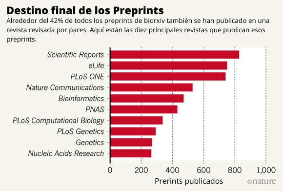

## Herramientas para publicar

Imagine que usted es parte de un equipo de investigación que finalizó un estudio sobre las repercusiones socio-económicas que tuvo la pandemia de Covid-19 en el país, desarrollando un aporte significativo para la toma de decisiones en materias de políticas económicas y levantando las bases para nuevas líneas de investigación. Dado el aporte que significan para el bien público los resultados de esta investigación, es necesaria su divulgación inmediata, pero es una realidad que la publicación regular en cualquier editorial toma un periodo largo de revisión y aceptación, es por ello que una alternativa es la pre-publicación del documento en un repositorio de Acceso Abierto. En la siguiente guía abordaremos un marco de referencia para empezar a adoptar prácticas ligadas al Open Access.

### El camino hacia la publicación

Todo proyecto de investigación tiene la potencialidad de ser publicado pero, como ya se ha ido ilustrando en las secciones anteriores, publicar de manera abierta trae consigo beneficios de visibilidad e impacto social. Para desarrollar una estrategia eficaz de publicación abierta hay que seguir un flujo que se divide tres pasos, como se ilustra en la Figura N° \@ref(fig:flujo). Este flujo inicia con la elección de la revista de Acceso Abierto, sigue con la identificación de la etapa del artículo y finaliza con la selección del servicio de publicación.

(\#fig:flujo)Guía paso a paso para publicar libre (Elaboración propia).

#### Paso 1: Pre-rint (Pre-publicación) {-}
Es lo que conocemos comúnmente como el borrador del artículo, el mismo que enviamos al proceso de revisión por pares. Este documento tiene la posibilidad de ser publicado en cualquier repositorio de ruta verde (*pre-print server*) con el objetivo de ser difundido abiertamente para permitir su disponibilidad inmediata.

La gran particularidad de este método de pre-publicación es que se obtiene un código alfanumérico que identifica y ubica el documento dentro de Internet, esto se conoce como un *Digital Object Identifier - DOI* (Identificador de Objeto Digital en español), por lo que se convierte de manera inmediata en un documento referenciable y sin posibilidad de plagio. Algunas personas tendrán el temor de que al pre-publicar un informe de investigación, las posibilidades de que el documento sea aceptado y posteriormente publicado en una revista es menor. Sin embargo, los datos empíricos demuestran que en realidad esto no es un impedimento para su posterior publicación. En la investigación de @abdill_tracking_2019 que analizó cerca de 37.648 pre-print alojados en bioRxiv -una extensión centrada en biología del sitio ArXiv-, una de las grandes conclusiones tiene que ver con que la tasa de preprints publicados en 2018 alcanzó un máximo de 2,100 por mes y, de manera más específica, en la Figura N° \@ref(fig:preprint) se puede identificar a las diez principales revistas que han publicado la mayor cantidad de pre-print. En esta figura, cada barra indica la cantidad de documentos publicados por cada revista. 

(\#fig:preprint)Destino final de los Preprint. Traducción propia en base al estudio de @abdill_tracking_2019

Para el caso de las ciencias sociales, el servicio de pre-print que recomendamos utilizar es [**SocArxiv**](https://socopen.org/){target="_blank"} y particularmente para la disciplina de la psicología [PsyArxiv](https://psyarxiv.com/){target="_blank"}. Estos servicios permiten subir archivos PDF desde la plataforma [Open Science Framework - OSF](https://help.osf.io/hc/en-us/categories/360001530554-Preprints){target="_blank"} (Marco de Ciencia Abierta en español) -un software de código abierto que permite la reproducibilidad de los procesos- y de este modo se obtiene el beneficio de acceder a un DOI que asegure su correcta citación. Ambos repositorios son extensiones de [ArXiv](https://arxiv.org/){target="_blank"}, la plataforma pionera de acceso abierto que en la actualidad alberga alrededor de dos millones de artículos categorizados en ocho áreas temáticas. ArXiv no posee tarifas asociadas a la publicación de los artículos, puesto que los documentos se someten a un proceso de clasificación y no a una revisión por pares. 

#### Paso 2: Post-print {-}
La segunda etapa es clave para el camino hacia la publicación, pues el post-print corresponde al artículo aceptado tras la revisión por pares, pero cuyo formato de presentación no ha sido adaptado al requerido. Por lo tanto no ha sido publicado de manera oficial por la revista y para lograr ello, interviene un equipo especializado de la editorial que se encarga de tales aspectos, ya sean márgenes, tipos de citación, estructura, entre otros.

Hoy en día si bien son varias las editoriales que entregan la posibilidad de publicar el post-print en cualquier repositorio abierto, esto es solo tras el periodo de embargo, el cual consiste en un tiempo determinado donde la editorial se reserva los derechos patrimoniales del artículo para su distribución. Dicho esto, recomendamos tener conocimiento de las posibilidades que tiene el autor de publicar un documento previo a la publicación oficial.

#### Paso 3: Print {-}
En la última etapa del flujo, recomendamos optar por abrir la publicación del *Print* (artículo final). El artículo final que es publicado oficialmente por una revista permite que la editorial conserve para sí los beneficios de los derechos patrimoniales de la obra, mientras que los equipos de investigación solo conservan el derecho al reconocimiento. Publicar en una revista de reconocimiento que integre políticas de acceso abierto brinda la posibilidad de que una vez finalizado el periodo de embargo, los autores puedan abrir sus artículos, pero no todas las revistas tienen las mismas políticas y directrices, por ello plantean formas y periodos distintos para el depósito del artículo en un repositorio abierto.

Al momento de realizar el envío de un artículo a una revista cualquiera, puede ocurrir que el autor tenga que firmar un *Acuerdo de Transferencia de Derechos (CTA por sus siglas en inglés)*, transfiriéndole al editor todo derecho sobre la obra y, por lo tanto, imposibilitando toda acción posterior del propio creador sobre la investigación. Para que la publicación dentro de una revista no afecte a la posterior decisión de abrir el acceso a una investigación, en ocasiones las editoriales plantean periodos de embargo en cuyo tiempo gozan de los beneficios económicos sobre la obra, pero al finalizar, el autor es libre de difundir en abierto su publicación. En estos casos los editores tienen una licencia que sirve únicamente para publicar, mientras que los autores deben retener para sí los derechos sobre la obra. En síntesis, para que cualquier recurso científico sea abierto, este debe contener una licencia que explicite a sus usuarios las acciones que pueden realizar sobre la obra e indicar la correcta acreditación de la fuente [@swan_directrices_2013]. 

### Revistas para publicar con Open Access

Por lo general, cuando llevamos tiempo investigando y publicando tenemos ciertas nociones de las revistas a las que les puede interesar los temas que estamos trabajando o incluso tenemos ciertas certezas de las posibles revistas en las cuales nuestro proyecto tiene una mayor probabilidad de ser publicado. El paso lógico para la publicación es elegir aquella editorial donde queremos que aparezca nuestro trabajo, ya sea por reconocimiento, por recomendaciones, por el tema que trabajamos o por cualquier otro motivo que tengamos. Una vez elegida la revista, se recomienda revisar las políticas de autoarchivo y para ello recomendamos acceder a [Sherpa Romeo](https://v2.sherpa.ac.uk/romeo/){target="_blank"} y buscar la revista escogida. Sherpa Romeo es un sitio web que funciona como una base de datos que recopila la información básica sobre las políticas de autoría y acceso abierto de las principales revistas científicas de todo el mundo que utiliza un código de cuatro colores para diferenciar los tipos de políticas de cada revista, los que se definen en la Figura N° \@ref(fig:colores-sherpa):

(\#fig:colores-sherpa)Etiquetas de colores de Sherpa Romeo según tipo de acceso abierto (Elaboración propia).

El mundo del Open Access es bastante grande y en ocasiones costoso, toda revista de ruta dorada posee costos de APC que deben ser financiados por los investigadores o sus patrocinantes, lo que se vuelve una barrera económica para los equipos de investigación que deseen abrir sus publicaciones, por ello el proceso de autoarchivo surge como una alternativa al alcance de cualquiera y, en su mayoría, cientistas sociales utilizan la vía verde y la diamante para depositar sus manuscritos o tesis en repositorios como [Dialnet](https://soporte.dialnet.unirioja.es/portal/es/kb/articles/el-acceso-abierto-a-la-literatura-cient%C3%ADfica){target="_blank"}, [Latindex](https://www.latindex.org/latindex/descripcion){target="_blank"}, [Scielo](https://scielo.org/es/sobre-el-scielo/declaracion-de-accesso-abierto/){target="_blank"}, [Redalyc](https://www.redalyc.org/){target="_blank"} y [CLACSO](http://biblioteca.clacso.edu.ar/accesoabierto/){target="_blank"}. Adicionalmente, existen revistas de ciencias sociales cuyo foco se encuentra en el diseño de metodologías de investigación cualitativa y que, además, poseen un alto factor de impacto, como las resumidas en la Tabla N° \@ref(tab:revc), pues son indexadas a Scopus [@ulloa_tendencias_2017]. 

| Revista                                                                                                  | País                    | Asunto o Categoría                     |
|----------------------------------------------------------------------------------------------------------|-------------------------|----------------------------------------|
| [Qualitative Sociology Review](http://www.qualitativesociologyreview.org){target="_blank"}               | Polonia                 | Ciencias Sociales diversas             |
| [The International Journal Qualitative Methods](https://journals.sagepub.com/home/ijq ){target="_blank"} | Canadá                  | Educación                              |
| [Forum Qualitative Sozialforscung](https://www.qualitative-research.net/index.php/fqs ){target="_blank"} | Alemania                | Ciencias Sociales diversas             |
Table: (\#tab:revc) Descripción de Revistas de Open Access de orden Cualitativo

 

Fuente: Adaptación propia a partir de tabla extraída del estudio de @ulloa_tendencias_2017.

### Pagos asociados a la publicación abierta

 

El Open Access está redefiniendo la forma en que el capital científico se define, se moviliza y se trata. Este es un nuevo paradigma que choca con las reglas de un mercado académico que por décadas ha mantenido el monopolio económico del conocimiento científico por medio de barreras de pago, un modelo que no siempre es receptivo a alteraciones y novedades [@sadaba_acceso_2014], pero que ha tenido la obligación de adaptarse al nuevo panorama cibernético digital.

El modelo de suscripción se presenta como un muro de pago que al ser costeado permite acceder al material científico. Detrás de cada ejemplar físico existe un costo de adaptación, impresión y envío, lo que obligaba a las editoriales a publicar una cantidad determinada. Sin embargo, con el advenimiento de Internet, la digitalización y la inmediatez de la información, las razones y argumentos que daban sustento al modelo se volvieron obsoletas. La era digital permitió avanzar a pasos agigantados en el desarrollo de nuevos conocimientos, en la difusión masiva e instantánea de los trabajos académicos y, por consecuencia, abrió paso al cuestionamiento de las suscripciones pagadas como método de acceso al conocimiento. En este sentido, la declaración que tuvo lugar en @bethesda_declaracion_2003 fue precisa en indicar que *"Internet ha cambiado fundamentalmente las realidades prácticas y económicas relacionadas con la distribución del conocimiento científico y el patrimonio cultural"*.

En la nueva era digital, el modelo de suscripción sigue estando presente, pero convive con el paradigma del open access, el que intenta superar las barreras de pago poniendo la responsabilidad de la apertura del conocimiento en el propio autor. Algunos repositorios de ruta dorada e híbrida solicitan un pago de APC para publicar en acceso abierto, esto corresponde a un modelo de negocios cuyo propósito es financiar los gastos asociados a la gestión de la publicación. En estricto rigor, no existe un monto estandarizado del APC, por lo que su costo dependerá únicamente de la revista. Su valor fluctúa según el pago de impuestos adicionales, lo que se puede evidenciar en la Tabla N° \@ref(tab:precio). Según @socha_cuanto_2018, de las revistas de mayor renombre en la industria académica como [Elsevier](https://www.elsevier.com/open-science){target="_blank"}, [Springer](https://www.springer.com/la/open-access){target="_blank"}, [Wiley](https://authorservices.wiley.com/author-resources/Journal-Authors/open-access/index.html){target="_blank"} y [Taylor & Francis](https://authorservices.taylorandfrancis.com/publishing-open-access/){target="_blank"} se han adscrito al acceso abierto cobrando a los autores un costo de APC pero manteniendo su modelo de suscripción. 

| Repositorio      | APC mínimo  | APC máximo  | ¿Open Acces o Híbrido? |
|------------------|-------------|-------------|------------------------|
| ELSEVIER         | $100        | $5.000      | Híbrido                |
| SPRINGER         | $3.000      | $3.000      | Híbrido                |
| WILEY            | $1.300      | $5.200      | Híbrido                |
| Taylor y Francis | $500        | $2.950      | Open Access            |
Table: (\#tab:precio) Fluctuación del precio en dolares del APC en las principales revistas científicas

 Fuente: Adaptación propia a partir de información recopilada en [University of Cambridge (2018)](https://www.openaccess.cam.ac.uk/publishing-open-access/how-much-do-publishers-charge-open-access){target="_blank"}.

@spinak_revistas_2019 indica que tanto en Estados Unidos como en países Europeos ha habido un aumento exponencial del costo del APC a través de los años. A modo de ejemplo, el *APC promedio de 319 revistas* asociadas a las editoriales *BMC, Frontiers, MDPI e Hindawi* aumentó entre 2,5 y 6 veces la inflación entre el 2012 y el 2018, al alero de un considerable crecimiento en la cantidad de volúmenes que paso de 58.007 hasta 127.528 en aquellos años. Los editores han admitido que el costo del APC lo fijan según el valor económico de la revista que es atribuido según el valor de impacto.

La introducción de un sistema de pagos por procesamiento de artículos hace frente al modelo de suscripción, pero no logra reemplazarlo. En cambio, funciona de manera paralela dentro del mercado científico, presentándose como una nueva barrera que obstaculiza la decisión de abrir las publicaciones de aquellas investigaciones que son autónomas o que dispongan de un presupuesto acotado. Los APC tienen sus propios cuestionamientos y uno de ellos refiere a que el pago no tiene mucho que ver con el procesamiento y posterior publicación del artículo, sino que más bien los equipos de investigación pagan por el reconocimiento de ser publicados en una revista de alto factor de impacto [@velterop_suscripciones_2018]. Pareciera ser que el nuevo ciclo de la ciencia que apuntaba a la democratización del conocimiento se vio inmerso en las lógicas económicas en donde las editoriales obtienen los principales beneficios monetarios.

*¿Pagar por hacer ciencia o pagar por reconocimiento?* Claro esta que existen otras vías gratuitas para publicar de manera abierta, sin embargo la ciencia -y principalmente las ligadas a la medicina, la física y las matemáticas- ha tenido la necesidad imperiosa de ser creíble, reconocida y citada, y por ello existe una mayor competencia en torno al reconocimiento que otorga la publicación en revistas de alto impacto. Sin embargo, el quehacer en pos del conocimiento y su disposición como bien público para la sociedad y su desarrollo poco tiene que ver con una distinción simbólica que sirve dentro del mundo científico. La ciencia social, a diferencia de las ciencias exactas, se ha podido desarrollar con mayor libertad por medio de las vías gratuitas en importantes repositorios de ruta verde, como es el ejemplo del caso latinoamericano que profundizaremos en la siguiente sección. 
