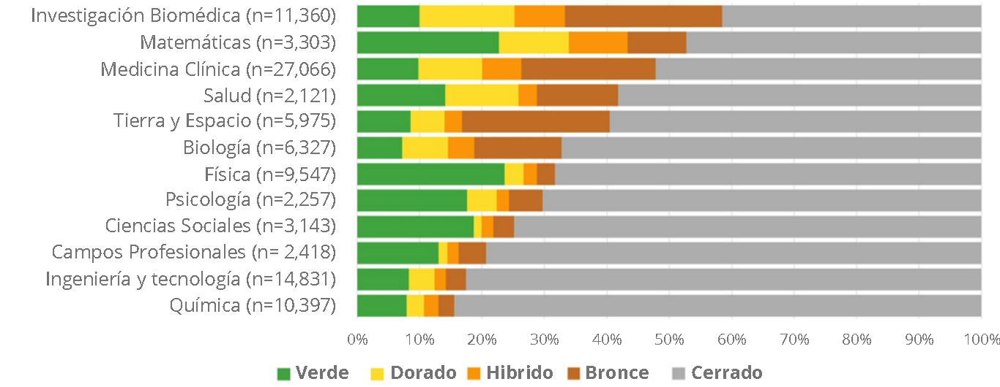

# ¿Cuál es el destino de las ciencias sociales en el mundo del Open Access?

La dicotomía entre ciencias naturales y sociales es una discusión epistemológica de años que no solo remite al objeto de estudio, sino que también a las metodologías de investigación, a los criterios de validez y quizás lo más importante, a la reflexión en torno al carácter objetivo de la propia ciencia. Es claro que el movimiento del Open Access no pretende dar respuestas ni reflexiones profundas sobre este tipo de cuestionamientos de orden epistemológico, y aunque se abre en extenso como una herramienta que sirve para la libre difusión de los conocimientos en el plano del Internet, una cosa es clara y es que las ciencias sociales han llegado algo tarde en comparación a las ciencias exactas [@sadaba_acceso_2014]. La comunidad científica ligada al campo de lo social ha hecho los esfuerzos por adquirir prácticas abiertas y de este modo, han comenzado a trazar una próspera trayectoria en el campo del Open Access con un fuerte componente político.

Las barreras de pago no son el único obstáculo que enfrenta la libre circulación del conocimiento científico, @banzato_soberania_2019 indica que la industria editorial ha instalado la idea de una ciencia del centro o bien denominada *mainstream*, un concepto consolidado globalmente gracias al trabajo hecho por los servicios de [Web Of Science WoS](https://clarivate.com/webofsciencegroup/release-notes/wos/new-wos-admin-faq/){target="_blank"} y [Scopus](https://www.elsevier.com/solutions/scopus?dgcid=RN_AGCM_Sourced_300005030){target="_blank"} que han creado indicadores bibliométricos que segmentan a las investigaciones científicas, fomentan el uso del inglés como la lengua ilustre de la ciencia, entregan prestigio a aquellos trabajos que siguen los estándares de publicación y son indexadas en las revistas de gran renombre. En suma, generan un sistema restrictivo donde existe poca representatividad de las revistas de ciencias sociales. Según [@beigel_relaciones_2018], las bases de datos comerciales no solo contribuyeron en la ilusión de una ciencia del *centro*, también desarrollaron la idea de un tipo de ciencia *"Periférica"* que refiere al trabajo que se reclusa en el terreno de la academia regional-local-como es el caso Latinoamericano-, este se indexa en revistas subvaloradas y comprendidas como endogámicas y debaja calidad, pues en su gran mayoría producen y re-producen el conocimiento dentro de la propia región, teniendo así un rol subsidiario en el desarrollo de la ciencia y no protagónico como es el caso anterior.

La apuesta del Open Access de hacer frente al oligopolio de la industria editorial y lograr un cambio sociocultural en la ciencia, a menudo tiene que luchar con condiciones sociales, culturales y económicas que terminan modelando la forma en que los cambios tecnológicos se convierten en cambios sociales, por ello el Open Access es un proceso diferencial no solo entre las disciplinas, sino que también entre las zonas geográficas y las distintas regiones del mundo [@sadaba_acceso_2014]. La globalización y el auge del Internet por sí mismos no democratizan ni permiten la distribución equitativa del conocimiento, por ello es importante adscribir a las palabras de @babini_universidades_2014, coordinadora del programa de acceso abierto de CLACSO, quién hace un llamado la comunidad científica de tomar responsabilidad por gestionar comunicaciones académicas no comerciales, cuyo objetivo sea permitir que el conocimiento se convierta en un **bien público** y por lo tanto, se gestione como tal.

La experiencia latinoamericana ha logrado arribar en el puerto de la ruta verde de una forma similar al contexto anglosajón, en el estudio de @piwowar_future_2019 se evidencia que tanto en ciencias sociales como en psicología se utiliza mayoritariamente la ruta verde para la publicación abierta (Véase figura n° \@ref(fig:piwowar2019)). Para el caso Latinoamericano, se ha creado una estructura no comercial donde la publicación libre es manejada por institutos de investigación sin fines de lucro o por universidades estatales, dando forma a un ecosistema sustentado por [Open Journals Systems](https://openjournalsystems.com/){target="_blank"} (Sistema de Revistas Abiertas en español), un software libre que entrega herramientas para la administración de plataformas digitales como [Latindex](https://www.latindex.org/latindex/inicio){target="_blank"}, [Redalyc](https://www.redalyc.org/){target="_blank"} y [Scielo](https://scielo.org/es/){target="_blank"}, los principales exponentes del Open Access en la región según @becerrilgarcia_end_2019. Estas plataformas sirvieron de trampolín para el desarrollo de la ciencia abierta de tipo *no comercial*, una distinción propia de Latinoamerica [@beigel_america_2021].

(\#fig:piwowar2019)Piwowar, H. et al. (2019). Porcentaje de diferentes tipos de acceso de una muestra aleatoria de artículos y reseñas de WoS con un DOI publicado entre 2009 y 2015 por disciplina (Traducción propia).

Algunas personas ligaran de manera exclusiva el Open Acces a metodologías de carácter cuantitativo, desconfiando del uso de estas técnicas para la investigación cualitativa con el temor de la pérdida de confidencialidad o el reproche sobre la toma de decisiones metodológicas. La evidencia levantada por @mardones_usos_2018 demuestra que existen experiencias cualitativas de trabajos publicados en abierto que no tienen repercusiones negativas, aún cuando estos declaran y describen sus diseños. Ello demuestra que la publicación abierta no afecta la particularidad y flexibilidad del diseño, siempre y cuando este se dirija con el fin de develar el fenómeno de estudio. 

@taylor_altmetric_2020 realizó un análisis sistemático de la publicación en abierto de libros y capítulos en el área de las ciencias sociales, pues ha habido una falta de atención en la publicación de libros en abierto, muy por el contrario al análisis que se realiza casi por completo a artículos y revistas. Este estudio comprende la existencia de un gran número de científicos sociales que se abocan publicar en libros y dentro de los resultados de la investigación, se evidencia que el número de libros y capítulos publicados en acceso abierto es mucho más bajo que el de los artículos, pero a través de los años ha ido en un ligero incremento, siendo estos en su gran mayoría de las disciplinas de la psicología y la economía, y en último lugar, textos del área de la filosofía. Lo anterior no solo evidencia un auge constante de la publicación de libros y capítulos en abierto, también da cuenta de que al igual que en el panorama general, dentro de las humanidades y las ciencias sociales ocurre una dicotomía entre las disciplinas.

Las revistas académicas y los repositorios antes mencionados son administrados, dirigidos y financiados por instituciones académicas o por organismos no gubernamentales sin fines de lucro -como es el caso del Centro Latinoamericano de Ciencias Sociales (CLACSO)-, por lo que no se incluyen tarifas ni para autores ni para lectores. América Latina ha desarrollado una suerte de *ecosistema en red*, que se configura cómo un espacio virtual donde los miembros de las universidades ponen a disposición el contenido intelectual en repositorios de sus casas de estudio, los cuales a su vez se encuentran interconectados a otros repositorios académicos. Un ejemplo claro de ello es [LaReferencia](https://www.lareferencia.info/es/){target="_blank"} que integra más de 1.3 millones de archivos según @becerrilgarcia_end_2019. En términos de políticas públicas, los organismos estatales han desarrollado leyes que promueven el uso de prácticas abiertas en el desarrollo de investigaciones con fondos estatales, sin embargo por lo que señala @becerrilgarcia_end_2019, los mandatos tienden a ser aún muy débiles y operan como sugerencias más que como obligaciones metodológicas. Otra debilidad indicada por el mismo estudio da cuenta de que la mayoría de los sistemas de validación social de las investigaciones descansan en el renombre de la revista, aún cuando estas se encuentren lejos de las discusiones locales o bien ajenas a los contextos latinoamericanos.

El destino de las ciencias sociales en el mundo del Open Access es bastante amplio. Los beneficios que entrega este paradigma no solo contribuyen a la difusión y amplio reconocimiento de la obra y de su autoría, también aportan a la apertura del conocimiento científico que sirve a nivel local en la toma de decisiones, en la consecución de estrategias políticas y a nivel regional en tanto aporta al desarrollo cultural y económico de la sociedad en su conjunto. Sin duda, el camino que han trazado otras personas sigue su curso e invita no solo a investigadores a incurrir en este tipo de prácticas, sino que también pone la responsabilidad en las instituciones universitarias y gubernamentales en proporcionar las herramientas, guías y conocimientos necesarios para que el Open Access sea una alternativa viable por la cual la ciencia y el conocimiento se transformen.

